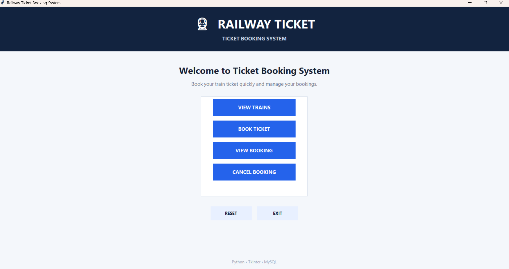

# Railway Ticket Booking System

## Technologies
- Python
- Tkinter GUI
- MySQL
- mysql-connector-python

## Files
- main.py       -> complete GUI/application
- database.py   -> MySQL connection and database setup
- ticket_booking.sql -> optional SQL setup

## 1. Install Python packages

Open PowerShell in this folder:

    pip install mysql-connector-python pillow

Pillow is not required by the current code, but it was used in the earlier version of the project and can remain installed.

## 2. Check MySQL

Make sure MySQL Server is running.

Open database.py and check:

    DB_HOST = "localhost"
    DB_USER = "root"
    DB_PASSWORD = "adithyan"

Change DB_PASSWORD if your MySQL root password is different.

## 3. Run the project

In PowerShell:

    cd "path\to\ticket_booking_system"
    python main.py

The program automatically creates:
- ticket_booking database
- trains table
- bookings table
- 4 sample trains (if the trains table is empty)

## Features

1. View Trains
2. Book Ticket
3. Booking Confirmation with Booking ID
4. View Booking using Booking ID
5. Cancel Booking
6. Reset
7. Exit

When a ticket is booked, the available seats decrease.
When a ticket is cancelled, the seats are returned to the train.

## Important

This is a local student project. The MySQL password is stored in database.py for simplicity. For a real application, use environment variables or a secrets manager.

## GUI Screenshot

